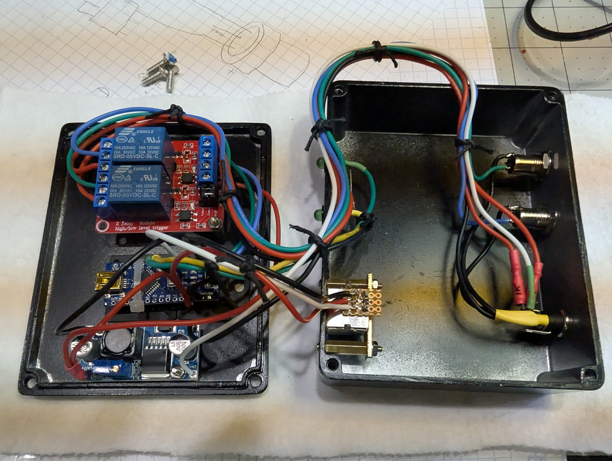

# IR-trigger
This is an arduino project to use arbitrary IR input and have output control of a 2-channel relay to serve as an externally controllable 12V trigger for audio device usage.

E.g. the Trinnov Altitude32 does not have IR commands for power on/off.  Reports are that WOL is flakey.  This unit does have a 12V trigger input.  

Parts required are any generic arduino board.  I'm using the Arduino Nano because I have spares, nothing special is needed.  
Additionally a 2-channel generic 5V relay board, buck converter and IR receiver are needed.

12V trigger voltage provided by a simple wall-wart.  Current is limited to approximately 100mA max by a 2W 120 ohm series resistor.

I picked a random non-conflicting device's IR commands for this unit.  That device is then selected in the universal remote for control.  The device selected is unimportant as long as it doesn't overlap with something already used in the existing system.

The wiring is simple: 

- the 12V wall wart directly powers the Vin and the buck converter.  Each 12V trigger output is fed by a 2W 120 ohm series
resistor to limit trigger output current to approximately 100mA.  The buck converter is set for 5V out and only powers the relays.  The reason
for this is to reduce the amount of current on the Arduino regulator.

- on the Arduino Nano, 

-- the IR input is on pin 2
-- Relay output is pin 3 and 4, for relay 1 and 2
-- LED indicators can be placed on pins 5 and 6.
